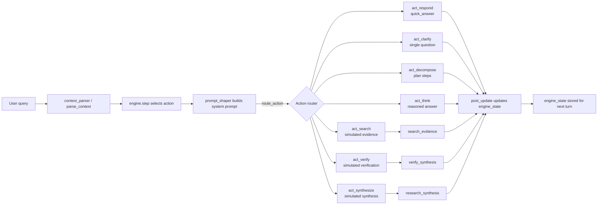

# MetaMo Prototype

MetaMo is an experimental control loop for Qwestor-style assistants. It predicts the best next action (respond, clarify, search, verify, decompose, think, synthesize) by parsing the user request, updating a stateful goal/anti-goal model, and routing execution through a LangGraph workflow.

## How It Works
- **parser.py** – Asks an LLM (OpenAI or Gemini) to turn the raw query into normalized context signals (urgency, complexity, ambiguity, evidence needs, etc.).
- **engine.py** – Maintains the long-lived state (goals, anti-goals, modulators) and scores every action for the current turn. It returns the winning action plus diagnostics that explain why it was chosen.
- **graph.py** – Builds the LangGraph state machine that wires together the parser, engine, prompt templates, and the action-specific LLM calls. Search/verification nodes are currently simulated and can be swapped with real tools.
- **runner.py** – A stress-test harness that replays curated sessions. It is useful for regression testing and for observing how the engine’s internal signals evolve over multiple turns.

### System flow


## Requirements
- Python 3.11+
- `pip install langgraph langchain-core langchain-openai langchain-google-genai langchain langchain-community python-dotenv`
- API access to at least one provider:
  - **OpenAI** – needs `OPENAI_API_KEY`, optional `OPENAI_MODEL` (defaults to `gpt-4.1-mini`).
  - **Google Gemini** – needs `GEMINI_API_KEY`, optional `GEMINI_MODEL` (defaults to `gemini-3-flash-preview`).

### Quick environment setup
```bash
./setup_env.sh            # creates .venv and installs dependencies
source .venv/bin/activate
```
The script accepts an optional path argument if you prefer a different venv location (e.g., `./setup_env.sh .venv-metam`). It reuses the environment on subsequent runs.

## Configuration
Copy `.env.example` to `.env` and adjust the values (or export them before running):

```env
LLM_PROVIDER=openai          # or "gemini"
OPENAI_API_KEY=sk-...
OPENAI_MODEL=gpt-4o-mini     # optional override
# GEMINI_API_KEY=...
# GEMINI_MODEL=gemini-1.5-pro
```

Only the keys for the selected provider are required. `LLM_PROVIDER` defaults to `gemini` if omitted. The example file keeps both providers so you can switch quickly by changing `LLM_PROVIDER`.

## Running the Stress Harness

```bash
python runner.py
```

`runner.py` instantiates the compiled LangGraph app, replays every scripted session, and prints (1) the chosen action, (2) the contextual signals produced by `parser.parse_context`, (3) the modulators/goals tracked inside the engine, and (4) the text returned by the action node. This is the fastest way to validate changes to `engine.py`, prompt shaping, or the parser contract.

## Tuning the Engine
Key knobs live in `engine.init_state()["params"]`:
- `*_alpha` values control how quickly modulators react to new context.
- `decompose_*` thresholds guard when decomposition is allowed.
- `reflective_think_bonus` / `reflective_search_penalty` bias the tie-breaker between `act_think` and `act_search`.
- `intent_margin` enforces extra separation before switching intent-specific actions.

Adjust these numbers, then re-run `python runner.py` to see how the selected actions and telemetry change over long sessions. The printed diagnostics help you spot oscillations, cold-start behavior, and anti-goal drift.

## Troubleshooting
- Missing API keys raise a `RuntimeError` before any network call is attempted.
- If the parser cannot coerce the provider output into JSON after three retries, the run aborts with a clear error message. Inspect the provider logs or `last_error` hint.
- LangGraph must be installed; otherwise importing `build_graph` fails. Install `langgraph` 0.2+.
- All commands run locally; no persistence is created unless you store `engine_state` yourself.
